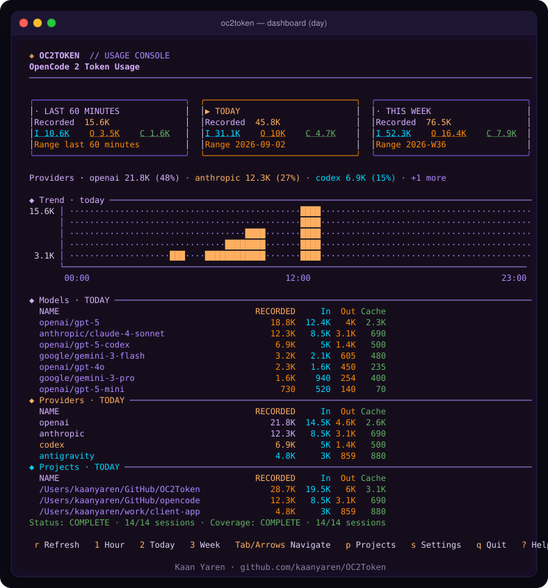
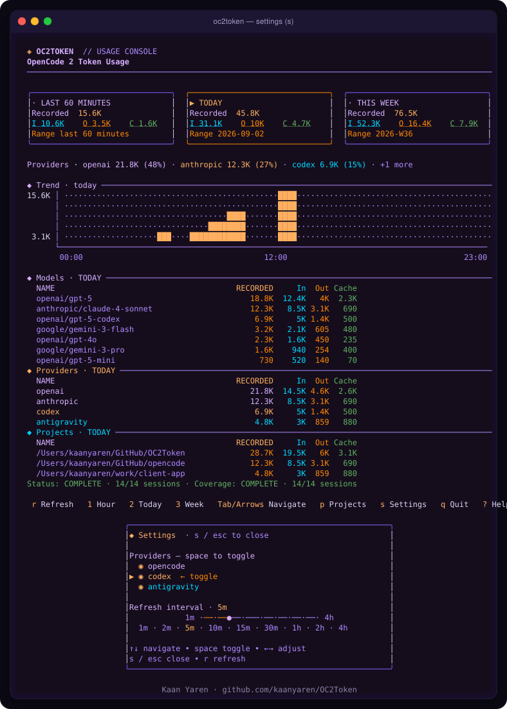
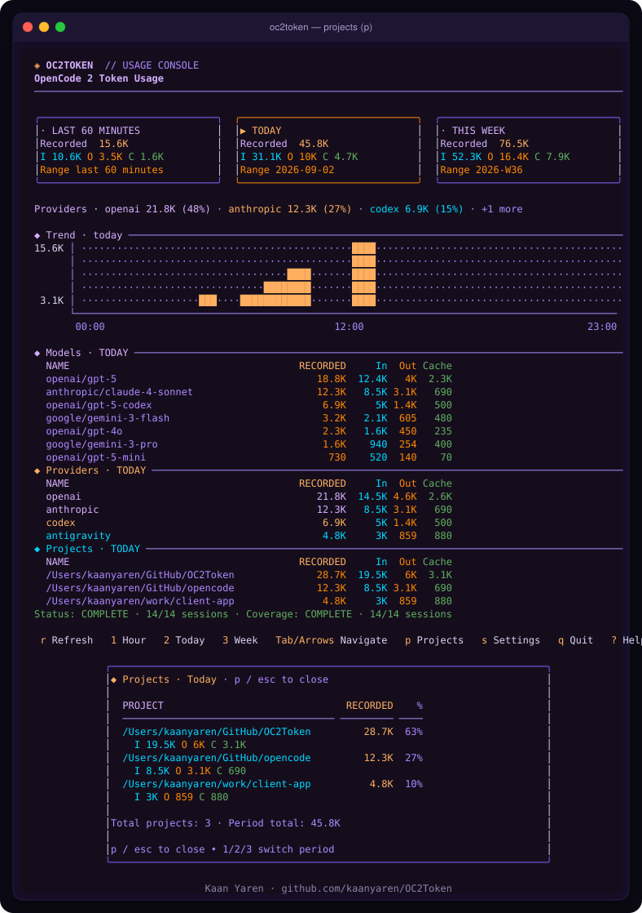
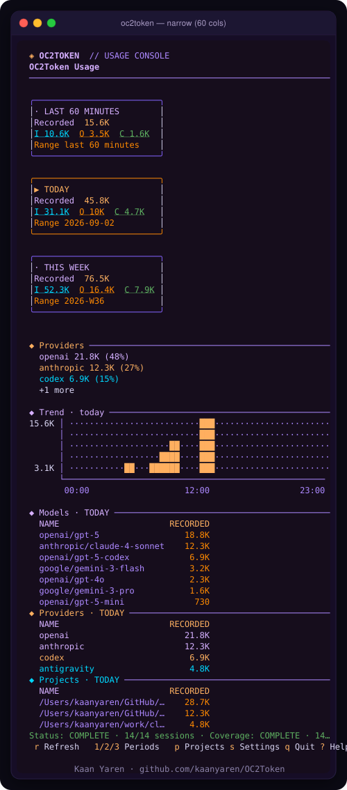
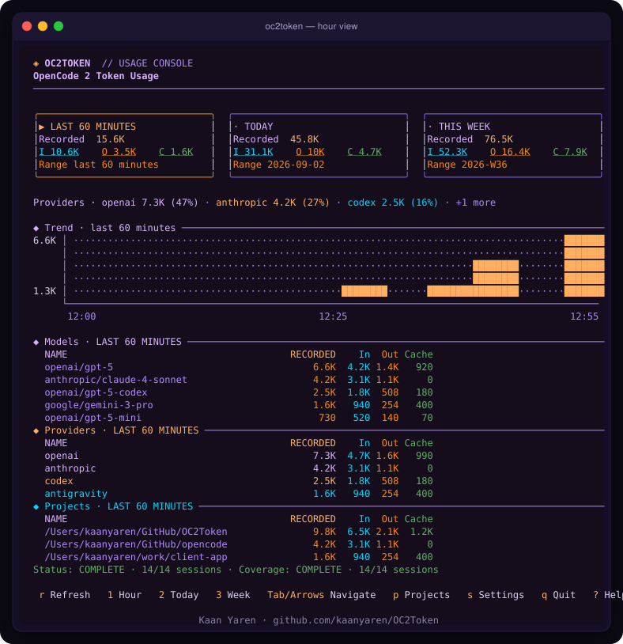
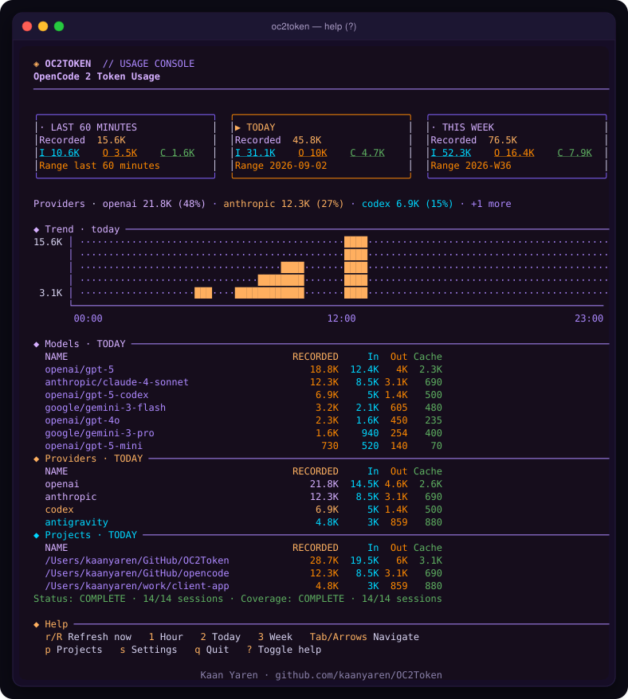
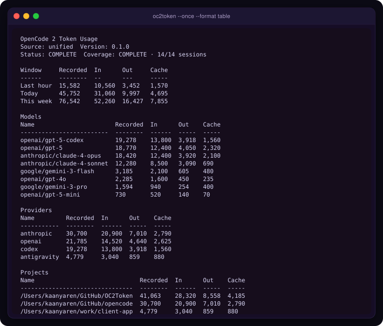

<p align="center">
  
</p>

<h1 align="center">OC2Token</h1>

<p align="center">
  <strong>macOS-first terminal dashboard for OpenCode&nbsp;2 token usage</strong><br/>
  Unified, privacy-preserving telemetry for <code>opencode</code> · <code>codex</code> · <code>antigravity</code>
</p>

<p align="center">
  <a href="https://www.npmjs.com/package/oc2token"></a>
  <a href="https://opensource.org/licenses/MIT"></a>
  <a href="https://nodejs.org">=20" /></a>
  <a href="#platform"></a>
  <a href="https://github.com/kaanyaren/OC2Token/issues"></a>
</p>

<p align="center">
  <code>npx oc2token</code>&ensp;·&ensp;<code>oc2token day</code>&ensp;·&ensp;<code>oc2token --json</code>&ensp;·&ensp;<code>oc2token doctor</code>
</p>

---

### Why OC2Token?

OpenCode 2 records rich token telemetry locally, but the raw message stream is noisy and per-provider. **OC2Token** is a single, fast, terminal-native console that:

- aggregates **all three providers** (`opencode`, `codex`, `antigravity`) into one unified report
- shows three exact windows — **last 60 minutes · today · this week** — with local-day and ISO-week semantics
- visualises a **sparkline trend**, per-model / per-provider / per-project breakdowns, and coverage status without ever persisting prompts or keys
- stays instantly usable over pipes (`--json`, `--format table`) for CI and scripting

> `recorded_total = input + output + reasoning + cacheRead + cacheWrite` — an explicit accounting sum, **not** a billing or quota total.

---

## ✨ Highlights

- **Unified multi-provider** — one snapshot, one schema, three colours (purple · orange · cyan)
- **Three exact windows** rendered side-by-side, responsive down to 20 columns
- **CodeBurn-inspired palette** — violet structure, orange focus, cyan inputs; `--no-color` / `NO_COLOR` safe
- **Trend sparkline** per window, not one row per bucket
- **Privacy by design** — only normalized token counters are cached; no prompts, tool inputs, or session titles are stored
- **Resilient collection** — paginated assistant-message aggregation with retry, dedup by `tokenRevision`, fallback when the filtered stats API ignores the range
- **Scriptable** — stable JSON `schemaVersion: 4`, deterministic table output, exit codes `0` / `1` / `3`

---

## 📸 Preview

<table>
<tr>
<td width="50%">

**Dashboard — day (100 cols)**
<br/>Three cards + inline provider stack + trend


</td>
<td width="50%">

**Settings overlay — `s`**
<br/>Toggle providers, scrub refresh interval



</td>
</tr>
<tr>
<td>

**Projects — `p`**
<br/>Per-project totals scoped to the selected window



</td>
<td>

**Narrow — 60 cols**
<br/>Stacks vertically, never wraps



</td>
</tr>
</table>

<details>
<summary>More screenshots</summary>

| View | Screenshot |
|------|------------|
| Hour (`1` / `oc2token hour`) |  |
| Help (`?`) |  |
| Table pipe (`--format table`) |  |

</details>

---

## 📦 Installation

### npm / npx (recommended)

```sh
npm install -g oc2token
# or without installing
npx oc2token
```

Requires **Node.js ≥ 20**. The OpenCode 2 local service must be reachable; OC2Token talks to it via `@opencode-ai/client` (beta API subject to change).

### From source

```sh
git clone https://github.com/kaanyaren/OC2Token.git
cd OC2Token
npm install
npm run build
npm link          # or: node dist/src/cli.js --help
```

### Verify

```sh
oc2token doctor          # human-readable health checks
oc2token doctor --json   # machine-readable
oc2token --help
```

---

## 🚀 Quick start

```sh
oc2token                # interactive dashboard, refreshes every 5 min
oc2token hour           # start on the rolling last-60-minutes card
oc2token day            # start on today's local-calendar day
oc2token week           # start on the ISO week (Mon–Sun)

oc2token --once --json  # one-shot JSON for scripting
oc2token --format table # deterministic plain table (great for pipes)
oc2token --refresh 0    # manual-only; press r to refresh
oc2token --timezone Europe/Istanbul  # override the local zone
oc2token --no-color     # or NO_COLOR=1 for plain output
```

---

## 🎮 Interactive dashboard

| Key / Click | Action |
|-------------|--------|
| `r` / `R` | Refresh now |
| `1` / `2` / `3` · **click top card** | Select **hour · day · week** |
| `Tab` / `←` `→` / `↑` `↓` | Cycle windows |
| `p` | Projects panel |
| `s` | Settings — toggle providers, adjust refresh |
| `?` | Help |
| `q` / `Ctrl+C` | Quit |

Settings persist under the cache directory (`~/Library/Caches/oc2token` on macOS by default; `$XDG_CACHE_HOME/oc2token` when `XDG_CACHE_HOME` is set, otherwise `~/Library/Caches/oc2token` — see `src/application.ts:47-50`). Override with `--cache-dir`. At least one provider must stay enabled.

**Theme.** Purple carries structure, orange carries activity and focus, cyan carries inputs. Respects `NO_COLOR` and `--no-color`.

---

## 🖥️ CLI reference

```
oc2token 0.1.1

Usage:
  oc2token [hour|day|week]
  oc2token [options]
  oc2token doctor [--source <provider>] [--json]

Options:
  --once                 Collect once and exit
  --json                 Emit stable JSON and exit
  --format <mode>        auto, dashboard, table, or json
  --refresh <seconds>    Auto-refresh cadence; 0 is manual-only (0 or 60–14400)
  --timezone <IANA>      Zone for local day / ISO week boundaries
  --project <id>         Restrict collection to an OpenCode project
  --cache-dir <path>     Override the normalized metadata cache directory
  --source <provider>    Filter providers: opencode, codex, antigravity, or all (repeatable)
  --no-color             Disable ANSI colors
  -h, --help             Show help
  -v, --version          Show version
```

### Exit codes

| Code | Meaning |
|------|---------|
| `0` | Success, complete coverage |
| `1` | Connection / validation / usage error |
| `3` | Partial results — JSON emitted but coverage incomplete |

### 💰 Costs (estimates only)

`costs`, `costsByProvider`, `costsByProject`, and per-breakdown `cost` fields are **rough USD estimates**, not bills. Pricing is compiled from public provider pages **as of 2026-09-02** (`src/pricing/pricing.ts:11-16`); rates change without notice and subscription/Zen at-cost pricing may differ from what you actually pay.

- Unknown models return `undefined` pricing (`pricingForModel` → `undefined`), surfaced as `null` cost in JSON. There is **no generic fallback price** — an unknown model contributes tokens but no dollars.
- `estimatedCostForBreakdowns(breakdowns, strict=true)` returns `undefined` if **any** model is unknown; the non-strict/partial variant skips unknown models instead. Window-level `costs` use the partial (skip-unknown) aggregation.
- `recorded_total` remains the source of truth for usage; costs are a convenience overlay.

### Filtering providers

```sh
oc2token --source codex                 # only Codex
oc2token --source opencode --source codex  # two providers
oc2token --source all                   # reset filter (default)
oc2token doctor --source antigravity --json
```

Combine with `--once` / `--json` for scripting:

```sh
oc2token --once --json --source codex | jq .totals.day.recorded_total
```

---

## 🔌 Providers

| Provider | Source | Discovery |
|----------|--------|-----------|
| **opencode** | OpenCode 2 local service (`@opencode-ai/client`) | session/message pagination with `tokenRevision` dedup |
| **codex** | `~/.codex/sessions` rollouts (JSONL) | file scan + parse |
| **antigravity** | Antigravity SQLite (`gen_metadata` protobuf via `node:sqlite` + `src/antigravity/proto.ts`) | proto + scanner |

All three emit the same `UsageRecord` shape and are merged by `Aggregator → CachedUsageSource → Dashboard`. `doctor` reports each independently:

```sh
oc2token doctor
# oc2token doctor: OK
# ✓ opencode: OpenCode 2 service OK
# ✓ codex: 14 sessions scanned
# ✓ antigravity: 3 projects indexed
```

---

## 📊 Output formats

### Table (pipes & logs)

No ANSI, deterministic — safe for `grep`, `awk`, `less`:

```sh
oc2token --format table
```

<p align="center"></p>

### JSON (`schemaVersion: 4`)

```sh
oc2token --json | jq .
oc2token --once --json > snapshot.json
```

Emits **all three windows**, `costs`, `totalsByProvider`/`totalsByProject`, `trends`, and coverage in one stable contract:

```json
{
  "schemaVersion": 4,
  "source": "unified",
  "version": "0.1.1",
  "windows": { "hour": { "kind": "hour", "from": "…", "to": "…", "label": "last 60 minutes" }, "day": {}, "week": {} },
  "totals": { "hour": { "recorded_total": 15582 }, "day": {}, "week": {} },
  "costs": { "hour": 0.042, "day": null, "week": null },
  "trends": { "hour": [{ "label": "…", "totals": {}, "from": "…", "to": "…" }], "day": [], "week": [] },
  "providersByWindow": { "day": [ { "name": "opencode", "totals": {}, "cost": 0.01 } ] },
  "totalsByProvider": { "day": { "opencode": { "recorded_total": 21785 } } },
  "totalsByProject": { "day": { "/Users/you/project": { "recorded_total": 9001 } } },
  "coverage": { "complete": true, "sessionsScanned": 14, "sessionsDiscovered": 14 }
}
```

> `costs` / `cost` fields are **estimates only** (see [Costs](#-costs-estimates-only)). Unknown models yield `null`/`undefined` cost, never a guessed price. `totalsByProject` keys are absolute project paths — treat snapshots as containing PII if you share them.

Use `--format json` for pretty-printed JSON without exiting interactive mode fallback.

---

## ⚙️ Configuration

| Option | CLI | Env / Persisted |
|--------|-----|-----------------|
| Timezone | `--timezone Europe/Berlin` | Local system zone by default; validated as IANA |
| Refresh | `--refresh 300` (`0` manual-only, or 60–14400) | Persisted via Settings panel (`s`) |
| Cache dir | `--cache-dir /tmp/oc2` | `~/Library/Caches/oc2token`, or `$XDG_CACHE_HOME/oc2token` when set |
| Project filter | `--project my-project` | Scopes OpenCode collection only |
| Providers | `--source codex` | Persisted via Settings panel |
| Color | `--no-color` | `NO_COLOR=1` disables all ANSI |

A corrupt or future cache is ignored — the live service is always the authority; the cache is an optimization.

---

## 🔒 Privacy

OC2Token stores **only normalized usage metadata**:

- `input`, `output`, `reasoning`, `cacheRead`, `cacheWrite`, `recorded_total`, model / provider / project names, timestamps

It **does not** persist:

- prompts, tool input/output, API keys, session titles, message bodies

All collection is local-first; no network calls besides the loopback OpenCode service.

### Paths are PII

`project` is persisted as an **absolute filesystem path** (e.g. `/Users/you/work/client-app`) in the normalized cache, in `--json` output (`totalsByProject`, `projects*`), and in table/dashboard project rows. Sharing a snapshot, cache directory, or screenshot exposes your directory layout and username. There is **no `--redact-projects` flag** — if you need to share output, scrub paths manually before posting.

### Snapshot sanitizer is denylist-based

`src/cache/schema.ts:47,225-259` strips known-sensitive keys (`prompt`, `tool_input/output`, `api_key`, `authorization`, `password`, `secret`, `session_title/name`, `raw_content`, plus `content`/`parts`/`title`) from cached snapshots. This is a **denylist, not an allowlist**: a future field with a novel sensitive name would pass through. Treat the cache as usage-metadata-only by construction (records go through `normalizeRecord`), and review sanitizer keys when new snapshot fields are added.

### `doctor` prints the endpoint

`oc2token doctor` prints `Endpoint: <url>` (loopback server URL) and per-provider status lines. The URL itself is not a credential (auth headers are never printed), but redact it in public bug reports anyway.

---

## 🧭 How it works

```
┌─────────────┐  ┌─────────────┐  ┌──────────────┐
│  opencode   │  │    codex    │  │ antigravity  │
│ transport   │  │   scanner   │  │   scanner    │
└──────┬──────┘  └──────┬──────┘  └──────┬───────┘
       │                │                │
       └────────────────┼────────────────┘
                        ▼
                 ┌─────────────┐
                 │ Aggregator  │  dedup by sessionID/messageID + tokenRevision
                 └──────┬──────┘
                        ▼
                 ┌──────────────┐  file lock · schema 2 · atomic writes
                 │ CachedUsage  │
                 └──────┬──────┘
                        ▼
              ┌───────────────────┐
              │  dashboard / json │  normalize → renderDashboard | renderTable | renderJSON
              └───────────────────┘
```

- Windows are derived with `Intl.DateTimeFormat` — including DST-aware local-day resolution.
- Filtered stats responses are range-validated; if the service ignores the range, OC2Token falls back to full pagination rather than mislabelling all-time usage as filtered.

---

## 🛠️ Development

```sh
npm install
npm test            # build + node --test
npm run typecheck
npm run pack:check  # dry-run npm pack
npm run build
```

Project layout:

```
src/
  accounting/   reducer for normalized records
  collector/    parallel/serial message collection
  opencode/     transport & doctor
  codex/        rollout discovery & scanner
  antigravity/  sqlite + proto + scanner
  cache/        filesystem lock & store (schema 2)
  dashboard/    render, state, settings
  domain/       windows, tokens, records, contracts
  output/       dashboard / table / json renderers
```

**Testing.** The suite uses `node:test` with a serial oracle vs parallel aggregator equivalence check, ANSI-gating invariants, and window-boundary coverage.

---

## 🤝 Contributing

Contributions are welcome — bug reports, new provider adapters, render polish, docs.

1. Fork & create a feature branch
2. Add tests for new behaviour (`npm test`)
3. Run `npm run typecheck`
4. Open a PR with a clear description and screenshots for UI changes

Please read the [MIT License](LICENSE). By contributing you agree to license your contributions under the same terms.

> Be kind. This project follows the spirit of the [Contributor Covenant](https://www.contributor-covenant.org/).

---

## 🙏 Acknowledgments

- [OpenCode 2](https://github.com/sst/opencode) for the local token telemetry API
- The CodeBurn palette inspiration (violet · orange · cyan)
- Built with TypeScript, `node:test`, and a lot of terminal love

---

## 📄 License

MIT © 2026 [Kaan Yaren](https://github.com/kaanyaren)

See [LICENSE](LICENSE) for details.

---

<p align="center">
  <sub>OC2Token is not affiliated with OpenCode. <code>recorded_total</code> is an accounting sum — not a billing total.</sub><br/>
  <sub><a href="https://github.com/kaanyaren/OC2Token">github.com/kaanyaren/OC2Token</a> · <code>npm i -g oc2token</code></sub>
</p>
